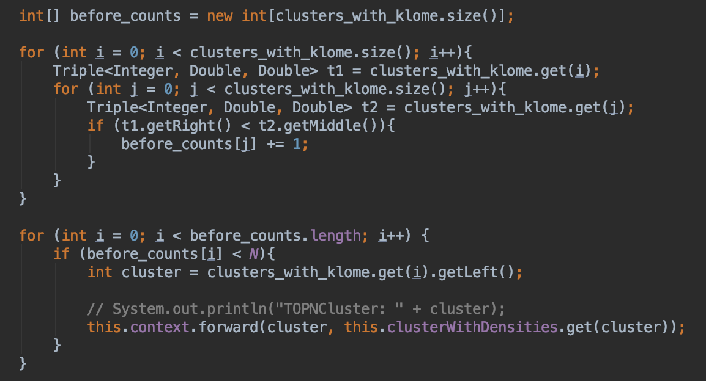

# KELOS-on-Kafka
KELOS (Scalable Kernel Density Estimation-based Local Outlier Detection over Large Data Streams) implementation using Kafka Streams

# 1 Abstract

# 2 Installation instructions

# 3 Motivation

Techniques for outlier detection are applicable to and needed for a variety of domains, ranging from financial fraud detection to network security [4]. The goal is to identify data points which are very different from the rest of the dataset. In the case of credit card fraud this could be card transactions accuring in a particularly high frequency or unusual location. The concept of *local* outliers works with the assumption that most datasets in the real-world are skewed and that their data points thus have varying distribution properties [1]. Therefore a point is considered an outlier only if the density at that spot is considerably lower than at the surrounding points, rather than taking the global dataset density into account. 

Due to an increase in the data sizes and sources we have to deal with nowadays, algorithms that work on data streams instead of whole datasets are in high demand. There exist a few approaches to do outlier detection using data streaming [2][3][4]. The KELOS algorithm [4] is an efficient and scalable solution to the problem. However, there is no publicly available implementation of this algorithm in a broadly adopted streaming framework, making it hard to deploy the algorithm in a real-world scenario. To remove this obstacle we chose to implement KELOS using Kafka Streams, a stream-processing library that is closely integrated with the popular Kafka message broker.

# 4 Related work

The concept of local outliers was first brought up by Breunig et al. in [1]. They were detected by computing the so called *local outlier factor* (LOF), a metric that measures the k-nearest neighbor distance of a point relative to the k-nearest neighbor distance of the points k-nearest neighbors. Though originally a batch computation, it has since been adapted to the streaming case by computing the LOF in an incremental way [2]. This was further improved upon with MiLOF [3], an algorithm that reduces the memory usage and time complexity of the outlier detection.

All these algorithms use the local outlier factor for ranking the outliers, but there are other approaches as well. One of them is kernel density estimation (KDE), a statistical technique for estimating probability density functions. It was first used for outlier detection in [5] then improved upon in [6]. The KELOS algorithm [4] implemented in this repository is the first to adapt KDE-based outlier detection to the streaming scenario.

There are also other notions of outliers besides the local density approach. One of them is the distance-based notion, where again multiple definitions exist. An example for distance-based definition is the distance-threshold definition, where a point is an outlier if there are less than k other points within a distance of R around the point. Examples for algorithms to detect these outliers in data streams include [7] and [8].

# 5 Architecture

## 5.1 Introduction to the KELOS algorithm

The KELOS algorithm [4] computes the Top-N outliers per sliding stream window. It works using Kernel Density Estimators, leveraging the statistical properties of the dataset to compute the density at a specific point.
The key difference to other local outlier detection algorithms is the introduction of abstract kernel centers. This innovation is based on the observation that all points in a cluster have a similar density and affect the density of points in other clusters in a similar way. Before doing the density calculation, the data points are clustered. Then the density measure is only computed for these clusters at first.

A kernel function, typically a gaussian probability density function, is used in order to get the density. Each cluster is weighted proportionally to the number of points it contains. For efficiency the density is computed heuristically per dimension and then multiplied rather then using euclidean distances.

Then an outlier score (KLOME score) gets computed and lower and upper bounds of that score determined for each cluster. Based on these bounds the clusters that will definitely not contain outliers get pruned. Finally the KLOME scores for all points in the remaining clusters are calculated to identifiy the outliers.

## 5.2 Architecture Overview

We stuctured our implementation following the same schema as [4] in their publication (see Figure 1). Our streaming pipeline start withs a producer reading in a dataset from some CSV file. The data abstractor module then clusters these input datapoints, producing two topics: The resulting clusters and the assignments of data points to these clusters. The density estimator computes the densities for the clusters and forwards them to the outlier detector which emits the outlier points at the end.

*Figure 1: Architecture Overview*

## 5.3 Data Abstractor

KELOS uses a micro-clustering approach, where newly arriving data points are simply added to the nearest existing cluster if the distance is smaller than a certain threshold. Otherwise a new cluster with that point will be created. 

For the density kernel a few statistical properties of the clusters have to be stored. These are the *cardinality*, *linear sum* of points per dimension and the *minimum* and *maximum* values per dimension. As these values have additive properties and the kernel is computed per dimension a sliding window semantic can be achieved in the following way:

The whole window gets split into several sub-windows, so called panes, the size of the window step size. The cluster metrics then only have to be computed at each step for the new pane. The oldest pane can merely expire and the metrics of the panes in between are kept and merged with the new pane. Figure 2 shows this process.

*Figure 2: Sliding window semantics [4]*

Kafka streams does not provide nested window functionality. To adapt this windowing technique we therefore set the window time our Kafka application to the pane size. The clustering is then performed in two Processors (see Figure 3). The first (ClusteringProcessor) clusters the points in each new window pane and forwards the clusters and their metrics for that pane. The second (AggregationProcessor) then receives one message per window pane containing the current cluster metrics. For every new pane arriving it deletes the oldest and merges the last panes with the new one. The forwarded clusters are then the ones for the complete sliding window ending at the current timestamp.

*Figure 3: Data Abstractor*

The clusters get serialized into the Kafka topics as objects of the Java class "Cluster". The class acts as a data container for all cluster metrics (cardinality, minima etc.) and their density scores later on.

## 5.4 Density Estimator

In the next step the densities at the cluster centroids get calculated. The density estimator first computes the k nearest neighbor clusters for each cluster in the current window. The next processor then calculates the density measure using a gaussian kernel for each dimension (see Formula 1). The parameter *u* of the function is the distance per dimension between the cluster's centroid and the centroid of a neighbor cluster. The kernel for each neighbor then gets weighted by the neighbor cluster's cardinality.

*Formula 1: Gaussian kernel*

In addition to the density estimate for the cluster, the processor also computes an upper and a lower bound for the density of the individual points in the cluster. This is done by making use of the radius metric that is tracked during the clustering. For each point P within a cluster C1 the distance between P and another cluster C2 is at least the distance between C1 and C2 minus the radius of C1 and at most the distance between C1 and C2 plus the radius. This property can be used to compute the density bounds.

*Figure 4: Density Estimator*

In summary, the density estimator takes the clusters as input and outputs the clusters with the estimated density, as well as the the lower and upper density bounds (see Figure 4).

## 5.5 Outlier Detector

The outlier detector takes the results of the previous steps and uses them to compute the top N outliers within the current window. First the PruningProcessor discards all clusters that can't possibly contain an outlier. This is done by first computing an outlier score (called KLOME score) for each cluster based on the densities calculated in the density estimator. This score compares the cluster's density with the density of its neighbors. If a cluster has a low KLOME score, it is likely to be an outlier. With the upper and lower density bounds similar bounds are computed for the KLOME score. Using these bounds, some clusters can be discarded, while others are forwarded to the FilterProcessor. This is done by ignoring all clusters whose lower KLOME score bound is greater than the upper bounds of at least N other clusters. If this is the case, we can say with certainty that the cluster at hand cannot contain outliers as we're only looking for the top-N outliers.

This process is described in detail in the KELOS publication [4]. The paper also contains a pseudo-code listing (see Algorithm 1 in [4, p. 6]) supposedly implementing the same pruning approach. However we found a discrepancy between the textual description and the pseudo-code, which does not seem to implement the discussed approach. We therefore chose to implement the pruning as introduced in the publication's text.

The pruning algorithm works as follows. For each cluster we keep track of how many other clusters have a smaller upper KLOME bound than the lower bound of the cluster we are looking at. We then only forward the clusters where less then N other clusters meet this condition. Figure 5 shows the implementation.

*Figure 5: Pruning Algorithm*

Here, all points that lie within clusters that are not pruned get tagged as all points are forwarded to the next processor. These points are the outlier candidates, the points that might be in the top N outliers. The remaining three processors then compute the KLOME scores of these candidates in a very similar manner as they were calculated for the clusters earlier (see figure 6). At the end of the pipeline, the PointPruningProcessor identifies the top N outliers amongst the candidates and thus the entire window.

*Figure 6: Outlier detector*

# 6 Evaluation

## 6.1 Performance Benchmark

*Comparison of number of neighbors*

*Figure 8: Comparison of number of window panes*

*Figure 9: Comparison of number of elements per window*

## 6.2 Experimental Setup

## 6.3 Results

# 7 Conclusion and future work

# References

[1] Markus M. Breunig, Hans-Peter Kriegel, Raymond T. Ng, and Jörg Sander. 2000. LOF: Identifying Density-based Local Outliers. In SIGMOD. 93–104.

[2] Dragoljub Pokrajac, Aleksandar Lazarevic, and Longin Jan Latecki. 2007. Incremental local outlier detection for data streams. In CIDM. IEEE, 504–515.

[3] Mahsa Salehi, Christopher Leckie, James C. Bezdek, Tharshan Vaithianathan, and Xuyun Zhang. 2016. Fast Memory Efficient Local Outlier Detection in
Data Streams. TKDE 28, 12 (2016), 3246–3260.

[4] Xiao Qin , Lei Cao , Elke A. Rundensteiner and Samuel Madden. 2019. Scalable Kernel Density Estimation-based Local Outlier Detection over Large Data Streams. 22nd International Conference on Extending Database Technology (EDBT)

[5] Longin Jan Latecki, Aleksandar Lazarevic, and Dragoljub Pokrajac. 2007. Outlier detection with kernel density functions. In MLDM. Springer, 61–75.

[6] Mahsa Salehi, Christopher Leckie, James C. Bezdek, Tharshan Vaithianathan, and Xuyun Zhang. 2016. Fast Memory Efficient Local Outlier Detection in Data Streams. TKDE 28, 12 (2016), 3246–3260.

[7] Lei Cao, Di Yang, Qingyang Wang, Yanwei Yu, Jiayuan Wang, and Elke A. Rundensteiner. 2014. Scalable distance-based outlier detection over high-volume data streams. In ICDE. IEEE, 76–87.

[8] Fabrizio Angiulli and Fabio Fassetti. 2007. Detecting distance-based outliers in streams of data. Proceedings of the sixteenth ACM conference on Conference on information and knowledge management. 811-820.
