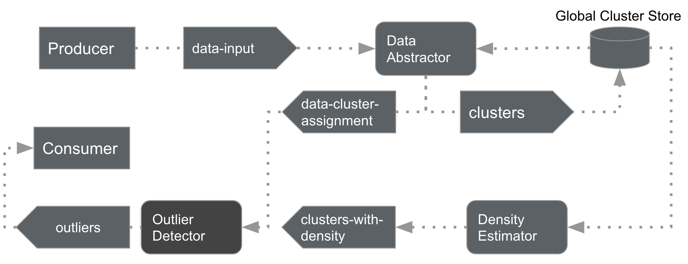
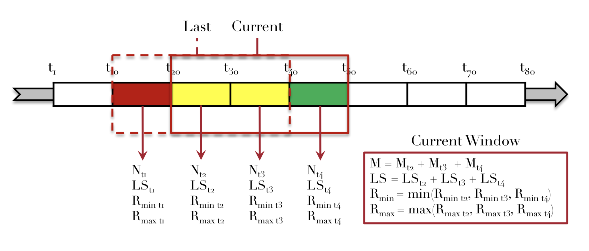
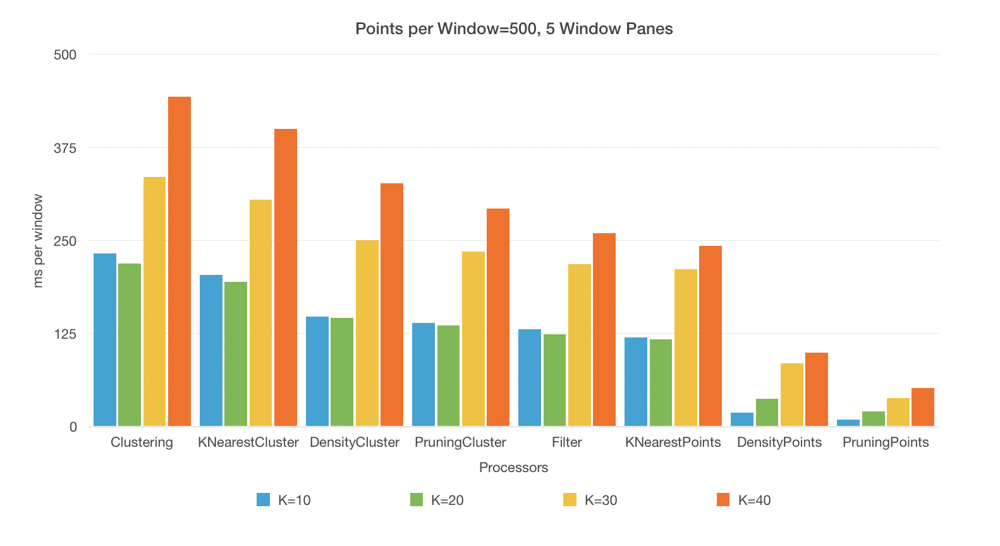

# KELOS-on-Kafka
KELOS (Scalable Kernel Density Estimation-based Local Outlier Detection over Large Data Streams) implementation using Kafka Streams

# 1 Abstract

The KELOS algorithm is an efficient approach to outlier detection in windowed streams, however the implementation used in the paper introducing it is not public. Implementing it in a widely used library such as Kafka Streams is a first step towards practical adoption of this algorithm. This repository contains such an implementation that makes use of Kafka Streams' low-level Processor API. It is shown to achieve a precision similar to that of the original implementation, however the performance is worse, making this a topic for future improvements.

# 2 Installation instructions

- Clone the repository
- ```docker-compose up -d``` to start Kafka broker
- Specify the source dataset in the [`Input Producer`](./src/main/java/KELOS/InputProducer.java)
- Specify parameters `K`, `N`, `AGGREGATION_WINDOWS` in the [`main class`](./src/main/java/KELOS/Main.java) and `ELEMENTS_PER_WINDOW` in the [`Input Producer`](./src/main/java/KELOS/InputProducer.java)
- Build the project with ```mvn clean compile assembly:single```
- Copy the dataset into the `target` folder
- Optional: Create empty CSV files in the `target` folder for the consumers you want to start (the names can be seen in the code, e.g. `outliers.csv` for the [`OutlierConsumer`](./src/main/java/KELOS/OutlierConsumer.java))
- Start the [`Input Producer`](./src/main/java/KELOS/InputProducer.java) with ```java -cp kelos-on-kafka-1.0.jar KELOS.InputProducer```
- Optional: Start the consumers you want to start with ```java -cp kelos-on-kafka-1.0.jar KELOS.<classname>```
- Start the [`main application`](./src/main/java/KELOS/Main.java) with ```java -cp kelos-on-kafka-1.0.jar KELOS.Main```
- Optional: If the data is 2D and you have kept track of candidates and outliers using their respective consumers, you may display them using [`visualize_outliers.py`](./visualize_outliers.py) after editing the filename it reads the data from

# 3 Motivation

Techniques for outlier detection are applicable to and needed for a variety of domains, ranging from financial fraud detection to network security [4]. The goal is to identify data points which are very different from the rest of the dataset. In the case of credit card fraud this could be card transactions occurring in a particularly high frequency or unusual location. The concept of *local* outliers works with the assumption that most datasets in the real-world are skewed and that their data points thus have varying distribution properties [1]. Therefore, a point is considered an outlier only if the density at that spot is considerably lower than at the surrounding points, rather than taking the global dataset density into account. 

Due to an increase in the data sizes and sources we have to deal with nowadays, algorithms that work on data streams instead of whole datasets are in high demand. There exist a few approaches to do outlier detection using data streaming [2][3][4]. The KELOS algorithm [4] is an efficient and scalable solution to the problem. However, there is no publicly available implementation of this algorithm in a broadly adopted streaming framework, making it hard to deploy the algorithm in a real-world scenario. To remove this obstacle, we chose to implement KELOS using Kafka Streams, a stream-processing library that is closely integrated with the popular Kafka message broker.

# 4 Related work

The concept of local outliers was first brought up by Breunig et al. in [1]. They were detected by computing the so-called *local outlier factor* (LOF), a metric that measures the k-nearest neighbor distance of a point relative to the k-nearest neighbor distance of the points k-nearest neighbors. Though originally a batch computation, it has since been adapted to the streaming case by computing the LOF in an incremental way [2]. This was further improved upon with MiLOF [3], an algorithm that reduces the memory usage and time complexity of the outlier detection.

All these algorithms use the local outlier factor for ranking the outliers, but there are other approaches as well. One of them is kernel density estimation (KDE), a statistical technique for estimating probability density functions. It was first used for outlier detection in [5] then improved upon in [6]. The KELOS algorithm [4] implemented in this repository is the first to adapt KDE-based outlier detection to the streaming scenario.

There are also other notions of outliers besides the local density approach. One of them is the distance-based notion, where again multiple definitions exist. An example for distance-based definition is the distance-threshold definition, where a point is an outlier if there are less than k other points within a distance of R around the point. Examples for algorithms to detect these outliers in data streams include [7] and [8].

# 5 Architecture

## 5.1 Introduction to the KELOS algorithm

The KELOS algorithm [4] computes the Top-N outliers per sliding stream window. It works using Kernel Density Estimators, leveraging the statistical properties of the dataset to compute the density at a specific point.
The key difference to other local outlier detection algorithms is the introduction of abstract kernel centers. This innovation is based on the observation that all points in a cluster have a similar density and affect the density of points in other clusters in a similar way. Before doing the density calculation, the data points are clustered. Then the density measure is only computed for these clusters at first.

A kernel function, typically a gaussian probability density function, is used in order to get the density. Each cluster is weighted proportionally to the number of points it contains. For efficiency the density is computed heuristically per dimension and then multiplied rather than using euclidean distances.

Then an outlier score (KLOME score) gets computed and lower and upper bounds of that score determined for each cluster. Based on these bounds the clusters that will definitely not contain outliers get pruned. Finally, the KLOME scores for all points in the remaining clusters are calculated to identify the outliers.

## 5.2 Implementation in Kafka Streams

Kafka Streams offers two APIs on different levels of abstraction: The high-level DSL (Domain Specific Language) and the low-level Processor API. The DSL has a simple, functional style however, it does not offer the flexibility needed to efficiently implement the complex KELOS algorithm. As a result, this project is using the more flexible Processor API that allows to manually define each step of the pipeline. 

Each pipeline starts with at least one Source, a Kafka topic that is consumed by the application and ends in at least one Sink, another Kafka topic that is being written to by the application. There may be multiple Sources and Sinks in complex pipelines. The actual processing of the data is done by Processors, nodes that are responsible for one step in the computation. The topology is defined as a Graph, where each Processor receives data from a Source or a previous Processor and forwards its results to another Processor or a Sink. The processors may access State Stores for their computations, allowing for stateful processing.

While more flexible that the DSL, the Processor API processes each point one by one, making windowing difficult to implement. We approached this problem by inserting the points into State Stores at first, to then do the actual computations in a callback method that is scheduled to run after the end of the window. This approach had the drawback that the order in which the callbacks are executed is not fixed, so if later parts of the pipeline are executed before earlier ones the computation will not proceed as expected. To mitigate this issue, we only use this method in the very first Processor and then trigger computations in the rest of the pipeline by manually passing a token that indicates the end of the window. This solution works but feels very complicated. It is entirely possible that there are better options and we simply failed to find them but if not, Kafka Streams may not be ideal for this kind of complex windowed algorithm.

## 5.3 Architecture Overview

We structured our implementation following the same schema as [4] in their publication (see Figure 1). Our streaming pipeline start with a producer reading in a dataset from some CSV file. The data abstractor module then clusters these input datapoints, producing two topics: The resulting clusters and the assignments of data points to these clusters. The density estimator computes the densities for the clusters and forwards them to the outlier detector which emits the outlier points at the end.


*Figure 1: Architecture Overview*


## 5.4 Data Abstractor

KELOS uses a micro-clustering approach, where newly arriving data points are simply added to the nearest existing cluster if the distance is smaller than a certain threshold. Otherwise a new cluster with that point will be created. 

For the density kernel a few statistical properties of the clusters must be stored. These are the *cardinality*, *linear sum* of points per dimension and the *minimum* and *maximum* values per dimension. As these values have additive properties and the kernel is computed per dimension a sliding window semantic can be achieved in the following way:

The whole window gets split into several sub-windows, so called panes, the size of the window step size. The cluster metrics then only have to be computed at each step for the new pane. The oldest pane can merely expire and the metrics of the panes in between are kept and merged with the new pane. Figure 2 shows this process.


*Figure 2: Sliding window semantics [4]*

Kafka streams does not provide nested window functionality. To adapt this windowing technique, we therefore set the window time our Kafka application to the pane size. The clustering is then performed in two Processors (see Figure 3). The first (ClusteringProcessor) clusters the points in each new window pane and forwards the clusters and their metrics for that pane. The second (AggregationProcessor) then receives one message per window pane containing the current cluster metrics. For every new pane arriving it deletes the oldest and merges the last panes with the new one. The forwarded clusters are then the ones for the complete sliding window ending at the current timestamp.


*Figure 3: Data Abstractor*

The clusters get serialized into the Kafka topics as objects of the Java class "Cluster". The class acts as a data container for all cluster metrics (cardinality, minima etc.) and their density scores later on.

## 5.5 Density Estimator

In the next step the densities at the cluster centroids get calculated. The density estimator first computes the k nearest neighbor clusters for each cluster in the current window. The next processor then calculates the density measure using a gaussian kernel for each dimension (see Formula 1). The parameter *u* of the function is the distance per dimension between the cluster's centroid and the centroid of a neighbor cluster. The kernel for each neighbor then gets weighted by the neighbor cluster's cardinality.


*Formula 1: Gaussian kernel*

In addition to the density estimate for the cluster, the processor also computes an upper and a lower bound for the density of the individual points in the cluster. This is done by making use of the radius metric that is tracked during the clustering. For each point P within a cluster C1 the distance between P and another cluster C2 is at least the distance between C1 and C2 minus the radius of C1 and at most the distance between C1 and C2 plus the radius. This property can be used to compute the density bounds.


*Figure 4: Density Estimator*

In summary, the density estimator takes the clusters as input and outputs the clusters with the estimated density, as well as the lower and upper density bounds (see Figure 4).

## 5.6 Outlier Detector

The outlier detector takes the results of the previous steps and uses them to compute the top N outliers within the current window. First the PruningProcessor discards all clusters that can't possibly contain an outlier. This is done by first computing an outlier score (called KLOME score) for each cluster based on the densities calculated in the density estimator. This score compares the cluster's density with the density of its neighbors. If a cluster has a low KLOME score, it is likely to be an outlier. With the upper and lower density bounds similar bounds are computed for the KLOME score. Using these bounds, we can identify clusters that do not contain outliers by checking if there are other clusters with a total cardinality of at least N that have an upper bound that is smaller than the clusters lower bound. If this is the case, we can say with certainty that the cluster at hand cannot contain outliers as we're only looking for the top-N outliers.

This process is described in detail in the KELOS publication [4]. The paper also contains a pseudo-code listing (see Algorithm 1 in [4, p. 6]) supposedly implementing the same pruning approach. However, we found a discrepancy between the textual description and the pseudo-code, which does not seem to implement the discussed approach. We therefore chose to implement the pruning as introduced in the publication's text.

The pruning algorithm works as follows. For each cluster we keep track of how many points are in clusters that have a smaller upper KLOME bound than the lower bound of the cluster we are looking at. We then only forward the clusters where less then N points meet this condition. Figure 5 shows the implementation.

```java
// Keep track for each cluster of how many points are in clusters with lower KLOME upper bounds
int[] smallerKlomeCounts = new int[clustersWithKlome.size()];

for (int i = 0; i < clustersWithKlome.size(); i++) {
    Triple<Integer, Double, Double> t1 = clustersWithKlome.get(i);
    int size = this.clusterWithDensities.get(t1.getLeft()).size;

    for (int j = 0; j < clustersWithKlome.size(); j++) {
        Triple<Integer, Double, Double> t2 = clustersWithKlome.get(j);
        if (t1.getRight() < t2.getMiddle()) {
            smallerKlomeCounts[j] += size;
        }
    }
}

// Determine whether the clusters might contain outliers
for (int i = 0; i < smallerKlomeCounts.length; i++) {
    int cluster = clustersWithKlome.get(i).getLeft();

    boolean might_contain_outliers = smallerKlomeCounts[i] < N;

    Pair<Cluster, Boolean> pair = Pair.of(this.clusterWithDensities.get(cluster), might_contain_outliers);
    this.context.forward(cluster, pair);
}
    
...

```
*Figure 5: Pruning Algorithm*

In the FilterProcessor, all points that lie within clusters that do not contain outliers are pruned, while the remaining points are forwarded to the next processor. These points are the outlier candidates, the points that might be in the top N outliers. The remaining three processors then compute the KLOME scores of these candidates in a very similar manner as they were calculated for the clusters earlier (see figure 6). At the end of the pipeline, the PointPruningProcessor identifies the top N outliers amongst the candidates and thus the entire window.


*Figure 6: Outlier detector*

# 6 Evaluation

## 6.1 Performance Benchmark

For analyzing the performance of the application, we used a synthetic three-dimensional dataset consisting of 3.000 data points.
We measured the average window processing time, i.e. per application window or sub-window pane, for every processor. The experiments were executed on a MacBook Pro (6x Intel Core i7 @ 2.2 GHz, 16GB RAM).

We evaluated the influence of several hyper-parameters: K (10, 20, 30, 40), Elements per window (100, 500, 1000) and Number of sub-window panes (2, 5, 10).

We notice that the runtime for each processed window decreases towards the end of the pipeline, with the ClusteringProcessor being the slowest computation (see figures 7, 8 and 9). This result is congruent with the runtime analysis in the KELOS publication.

The number of panes per sliding window has no effect on the performance. We contribute the small fluctuations in processing speed in our experiments (figure 7) to measuring inaccuracies.


*Figure 7: Comparison of number of window panes*

The number of neighbors has a linear influence on the processing speed (see figure 8). Only for a small number for K (10 or 20) the runtime remains the same.


*Figure 8: Comparison of number of neighbors*

Furthermore, our experiments show that the runtime per window scales linearly with the number of data points per window (see figure 9).


*Figure 9: Comparison of number of elements per window*

If you attended our last presentation on this project you may notice that these results differ from those we presented there. This is due to two reasons:

1. We discovered that we did not measure the runtime of the clustering correctly during our first run of benchmarks. As you can see the revised results show a much higher runtime.

2. We first misunderstood the calculation of the KLOME scores for the individual points (in the KNNPointsProcessor and afterwards). We initially believed that the KNN computation was supposed to find the K nearest points, but in fact it only needs to find the K clusters that are closest to the candidate. As there are way less clusters than points the KNNPointsProcessor is now much faster than before the changes.


## 6.2 Effectiveness Evaluation

For evaluating the effectiveness of our implementation, we compare our results to those in the paper. In the original publication, the algorithm was tested on three real-world datasets. Unfortunately, we were unable to obtain the Yahoo! A1 and Yahoo! A2 datasets [9] because the registration necessary to access them did not work on multiple separate attempts. The last dataset is from KDD99 [10] but mismatches in the number of records indicate that not the entire dataset was used. The paper itself does not mention this, however we believe that the dataset was preprocessed as described in [11], because the number of records reported there matches those in the base paper. The transformed dataset was taken from [here](http://odds.cs.stonybrook.edu/http-kddcup99-dataset/).

The benchmarked metric is the *Precision@|O|* that was also used in the base paper [4]. It is calculated by dividing the total number of correctly identified outliers over all windows through the number of ground truth outliers present in them (see formula 1). Assuming there are *|O|<sub>i</sub>* ground truth outliers in the i-th window, only those that are among the top-*|O|<sub>i</sub>* points with the lowest KLOME score in the window are considered to be correctly identified. Since we work with sliding windows, outliers will be counted multiple times because they appear in multiple windows.


*Formula 2: P@|O| calculation [4]*

The evaluation was done with a clustering threshold of 0.095 and a window size of 6000 points as the original paper found those to be the ideal values for the dataset. The slide size was set to 2000 points, while k was varied between 5 and 100. 


*Figure 10: P@|O| for different k on HTTP dataset*

As figure 10 shows, the *P@|O|* rises quickly as k increases to 50, reaches its maximum around 100 and then starts to fall off again. These results are in line with those reported in the base paper, confirming that our implementation of the KELOS-algorithm is correct.

# 7 Conclusion and future work

In this project we implemented the KELOS algorithm for outlier detection in windowed streams using the Kafka Streams library. To do so, we used Kafka Streams low-level Processor API, resulting in an architecture that splits the tasks into different processor nodes. This goal was achieved as the evaluation shows results that are very similar to those of the original implementation. However, unless there are additional options that we overlooked, Kafka Streams does not seem to be ideal for this task as we struggled to implement the windowing.

The most obvious area for future improvements is the performance of the implementation. Though our results are not directly comparable to those in the base paper because of different hardware and different measured variables, it is clear that our implementation is slower. Reaching the performance of a purpose-built implementation with standard libraries may not be possible, but there is still room for improvement. One area where improvements could be made is the computation of the k-nearest neighbors. The current implementation uses the naive approach with quadratic runtime but using data structures such as k-d trees could be significantly faster. Even larger gains could be made by leveraging data parallelism by modifying the code so that multiple instances of the same processor can run in parallel and work on different parts of the data.

# References

[1] Markus M. Breunig, Hans-Peter Kriegel, Raymond T. Ng, and Jörg Sander. 2000. LOF: Identifying Density-based Local Outliers. In SIGMOD. 93–104.

[2] Dragoljub Pokrajac, Aleksandar Lazarevic, and Longin Jan Latecki. 2007. Incremental local outlier detection for data streams. In CIDM. IEEE, 504–515.

[3] Mahsa Salehi, Christopher Leckie, James C. Bezdek, Tharshan Vaithianathan, and Xuyun Zhang. 2016. Fast Memory Efficient Local Outlier Detection in
Data Streams. TKDE 28, 12 (2016), 3246–3260.

[4] Xiao Qin , Lei Cao , Elke A. Rundensteiner and Samuel Madden. 2019. Scalable Kernel Density Estimation-based Local Outlier Detection over Large Data Streams. 22nd International Conference on Extending Database Technology (EDBT)

[5] Longin Jan Latecki, Aleksandar Lazarevic, and Dragoljub Pokrajac. 2007. Outlier detection with kernel density functions. In MLDM. Springer, 61–75.

[6] Mahsa Salehi, Christopher Leckie, James C. Bezdek, Tharshan Vaithianathan, and Xuyun Zhang. 2016. Fast Memory Efficient Local Outlier Detection in Data Streams. TKDE 28, 12 (2016), 3246–3260.

[7] Lei Cao, Di Yang, Qingyang Wang, Yanwei Yu, Jiayuan Wang, and Elke A. Rundensteiner. 2014. Scalable distance-based outlier detection over high-volume data streams. In ICDE. IEEE, 76–87.

[8] Fabrizio Angiulli and Fabio Fassetti. 2007. Detecting distance-based outliers in streams of data. Proceedings of the sixteenth ACM conference on Conference on information and knowledge management. 811-820.

[9] Nikolay Laptev, Saeed Amizadeh, and Ian Flint. 2015. Generic and Scalable Framework for Automated Time-series Anomaly Detection. In SIGKDD. 1939–1947.

[10] The Third International Knowledge Discovery and Data Mining Tools Competition. 1999. KDD Cup Dataset. http://kdd.ics.uci.edu/databases/kddcup99/kddcup99.html (1999).

[11] Kenji Yamanishi, Jun-Ichi Takeuchi, Graham Williams and Peter Milne. 2000. On-line unsupervised outlier detection using finite mixtures with discounting learning algorithms. In Data Mining and Knowledge Discovery.
